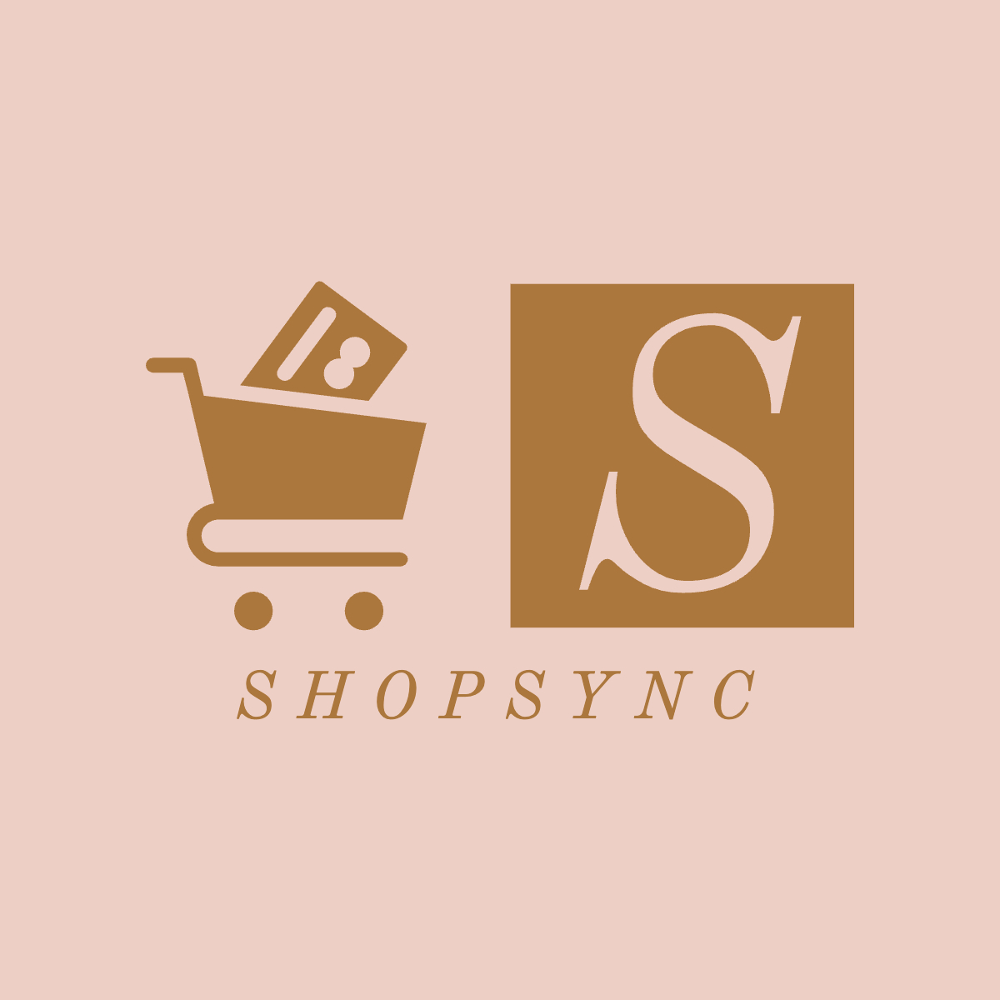
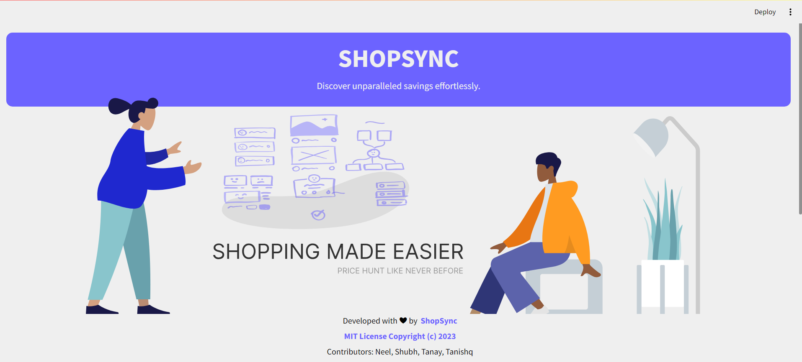
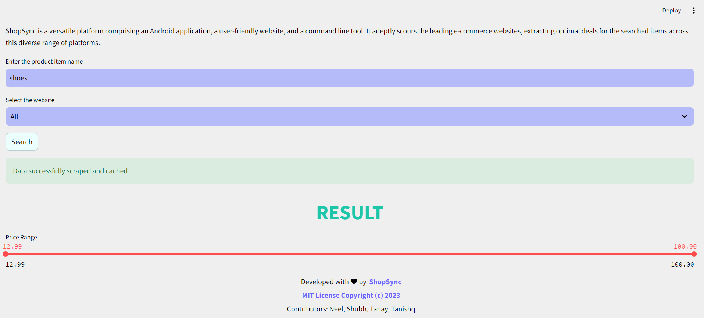
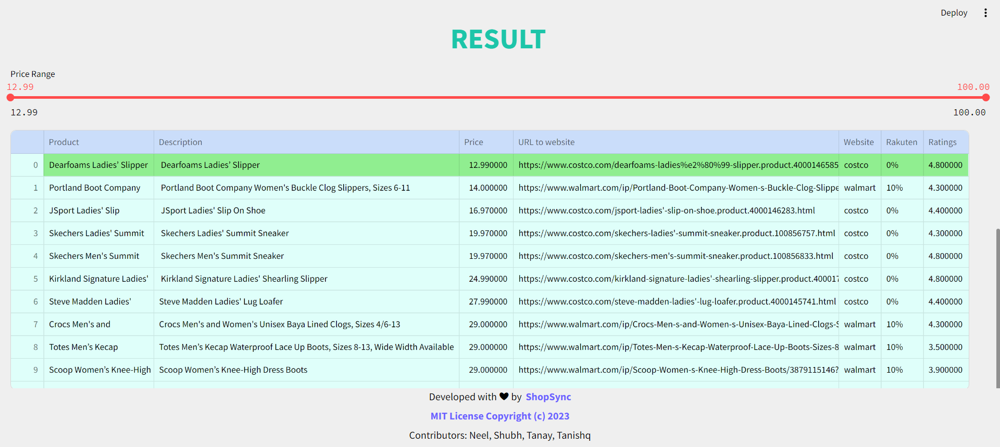
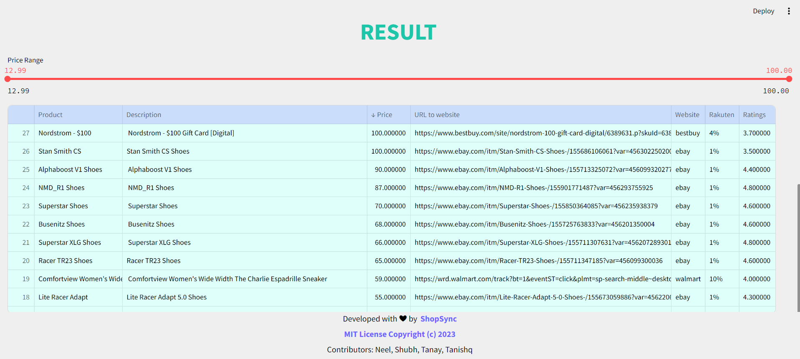
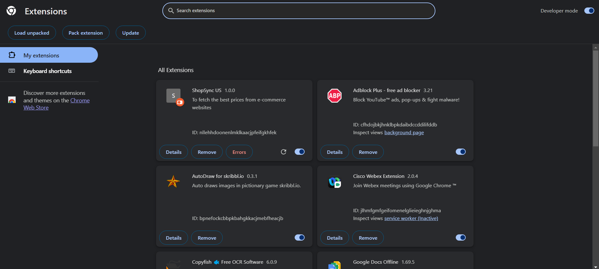
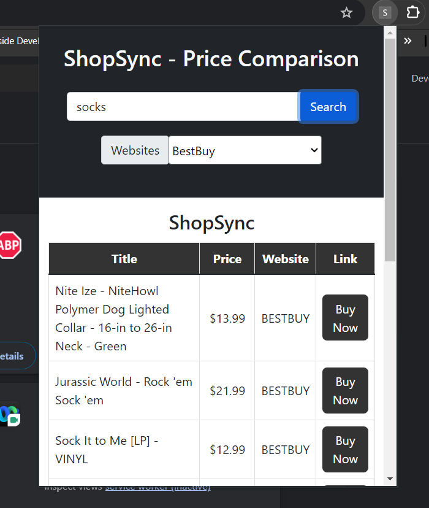

<p align="center"></p>

[](https://www.python.org/)
[](https://doi.org/10.5281/zenodo.10212026)
[](https://badgen.net/github/stars/Neel317/ShopSync)
[](https://doi.org/10.5281/zenodo.14020467)
[](https://codecov.io/github/devyash2930/ShopSync-SE)
[](https://github.com/devyash2930/ShopSync-SE/actions/workflows/unit_test.yml)
[](https://github.com/devyash2930/ShopSync-SE/actions/workflows/main.yml)
[](https://github.com/devyash2930/ShopSync-SE/actions/workflows/code_cov.yml)


<!--Badges-->
<a href="https://github.com/Neel317/ShopSync/blob/main/LICENSE"></a>
<a href="https://github.com/Neel317/ShopSync/pulse"></a>
<a href="https://github.com/Neel317/ShopSync/issues"></a>


<p align="center">
    <a href="https://github.com/Neel317/ShopSync/issues/new/choose">Report Bug</a>
    ·
    <a href="https://github.com/Neel317/ShopSync/issues/new/choose">Request Feature</a>
</p>


Are you a shopping enthusiast on the hunt for fantastic online deals? Look no further – Shopsync is your ultimate ally in the quest for the best bargains!
Shopsync is a publicly accessible web API framework designed for convenient price comparison across popular e-commerce platforms. It supports well-known websites such as Amazon, Walmart, Target, BestBuy, Costco, and eBay. Currently supported websites include [Amazon](https://www.amazon.com/), [Walmart](https://www.walmart.com/), [Target](https://www.target.com/), [BestBuy](https://www.bestbuy.com/), [Costco](https://www.costco.com/) and [EBay](https://www.ebay.com/). 
The key benefits of using Shopsync are:

- **Efficiency**: By utilizing Shopsync, you can drastically reduce the time spent comparing deals on various websites, often saving more than 50% of your time.

- **Simplicity**: Shopsync offers user-friendly public APIs that simplify filtering, sorting, and searching for the best deals among search results.

- **Versatility**: It generates JSON responses that are highly adaptable, allowing you to easily tailor the output to suit your specific needs.

---

<p align="center">
  <a href="#movie_camera-checkout-our-video">Checkout our video</a>
  ::
  <a href="#rocket-installation">Installation</a>
  ::
  <a href="#computer-technology-used">Technology Used</a>
  ::
  <a href="#bulb-use-case">Use Case</a>
  ::
  <a href="#page_facing_up-why">Why</a>
  ::
  <a href="#golf-future-roadmap">Future Roadmap</a>
  ::
  <a href="#sparkles-contributors">Contributors</a>
  ::
  <a href="#Acknowledgement">Acknowledgement</a>
  ::
  <a href="#email-support">Support</a>
  
</p>

---

:movie_camera: Checkout our video
---

https://github.com/Neel317/ShopSync/assets/67258403/5e8856c0-a7d4-45fc-b3ae-7c2397694149

---

:blue_book: Project 3 Documentation
---

[Link to Docs in REPO...](https://github.com/Neel317/ShopSync/tree/main/docs)

---

:rocket: Installation
---
1. Clone the Github repository to a desired location on your computer. You will need [git](https://git-scm.com/) to be preinstalled on your machine. Once the repository is cloned, you will then ```cd``` into the local repository.
```
git clone https://github.com/Neel317/ShopSync.git
```
2. This project uses Python 3, so make sure that [Python](https://www.python.org/downloads/) and [Pip](https://pip.pypa.io/en/stable/installation/) are preinstalled. All requirements of the project are listed in the ```requirements.txt``` file. Use pip to install all of those.
```
pip3 install -r requirements.txt
```
4. Once all the requirements are installed, you will have to ```cd``` into the ```src``` folder. Once in the ```src``` folder, use the python command to run the ```main.py``` file.
```
cd src

For Mac
python3 main.py

For Windows
python main.py
```
5. To run streamlit application
```
streamlit run slash_user_interface.py
```

6. To build the Docker image
```
docker build -t shopsync .
```
7. Run the Docker container
```
docker run -p 8501:8501 shopsync2.1
```
8. List running containers to get the CONTAINER_ID
```
docker ps
```
9. To stop container
```
docker stop <CONTAINER_ID>
```
:computer: Technology Used
---


## 🔄 Work Flow

<table border="2" bordercolorlight="#b9dcff" bordercolordark="#006fdd">

  <tr style="background: #010203 ">
    <td valign="top"> 
      <p style="color: #FF7A59"> Landing Page
      </p>
      <a href="./media/Landing_Page.png"> 
              
      </a>
    </td>
    <td valign="top">
     <p style="color: #FF7A59"> Sample Query
      </p>
     <a href="./media/Query.png">
         
      </a> 
    </td>
  </tr>
  
  <tr style="background: #010203;"> 
    <td valign="top">
     <p style="color: #FF7A59"> Sample Query Result
      </p>
     <a href="./media/Query_result.png">
         
      </a> 
    </td>
    <td valign="top"> 
      <p style="color: #FF7A59"> Filtering Based on Price
      </p>
      <a href="./media/Price_filtering.png">
         
      </a>
    </td> 
  </tr>
  
<tr style="background: #010203;"> 
    <td valign="top">
     <p style="color: #FF7A59"> Adding Chrome Extension
      </p>
     <a href="./media/Manage_extension.png">
         
      </a> 
    </td>
    <td valign="top"> 
      <p style="color: #FF7A59"> Sample Query On Extension
      </p>
      <a href="./media/base_extension.png">
         
      </a>
    </td> 
  </tr>
  
</table>


## 🖱️Reasons to Add Chrome Extension

- **Seamless Integration:** Allows seamless integration with the user's browser environment, providing a convenient and familiar interface.
- **User Accessibility:** Enables easy access and use of web scraper functionalities with a single click, catering to users who prefer quick interactions.
- **Enhanced Functionality:** Adds extra features to extend the web scraper's capabilities beyond a standalone web app, incorporating browser-specific optimizations.
- **Real-time Interactivity:** Facilitates user interaction in real-time during browsing, empowering them to initiate scraping tasks or customize settings on the fly for an improved user experience.

:bulb: Use Case
---
* ***Empowering Students***: University students, often operating on tight budgets and time constraints, typically squander precious hours scouring websites for products. Enter ShopSync, the ultimate companion for students, slicing away all the superfluous website clutter and swiftly delivering product prices from multiple sources. Maximize the benefits of this invaluable tool during the forthcoming Black Friday Sale, where savings are paramount.
* ***Elevating Data Analysts***: Data analysts grapple with the formidable task of data acquisition for their projects, a task that can be arduous and plagued by outdated datasets. ShopSync offers a game-changing solution, enabling analysts to craft real-time datasets tailored to their specifications. With this capability, they can concentrate their efforts on what truly matters, driving impactful results.
  
:page_facing_up: Why
---
- In a market where we are spoilt for choices, we often look for the best deals.  
- The ubiquity of internet access has leveled the retail playing field, making it easy for individuals and businesses to sell products without geographic limitation. In 2020, U.S. e-commerce sales, receiving a boost due to the COVID-19 pandemic, grew 44% and represented more than 21% of total retail sales, according to e-commerce information source Internet Retailer.
- The growth of e-commerce has not only changed the way customers shop, but also their expectations of how brands approach customer service, personalize communications, and provide customers choices.
- E-commerce market has prompted cut throat competition amongst dealers, which is discernable through the price patterns for products of major market players. Price cuts are somewhat of a norm now and getting the best deal for your money can sometimes be a hassle (even while online shopping).
- This is what Shopsync aims to reduce by giving you an easy to use, all in one place solution for finding the best deals for your products that major market dealers have to offer!
- ShopSync in its current form is for students who wish to get the best deals out of every e-commerce site and can be used by anyone who is willing to develop an application that consumes these web APIs.
- Future scope includes anything from a web application with a frontend or any Android or IOS application that utilises these Web APIs at their backend. Anyone can build their own custom application on top of these web APIs.

## Δ Deltas

### Phase 4:

- [x] Introduced a feature-rich Chrome extension to enhance functionality.
- [x] Implemented an advanced filter with ascending & descending ordering for all columns for more tailored user experience.
- [x] Revamped the user interface, providing a polished and modernized look and feel.
- [x] Incorporated a Rakuten cashback column to provide users with valuable shopping insights.
- [x] Added new badges and updated the tech stack to reflect the latest technologies.
- [x] Conducted major enhancements to the scraping functionality, expanding data sources to include Amazon, Target, BestBuy and Costco.
- [x] Integrated a Docker image for streamlined and efficient containerized deployment.
- [x] Introduced a user ratings column, enabling users to make informed decisions based on product feedback.
- [x] Crafted an engaging demo video, showcasing the application's enhanced features and capabilities.


:golf: Future Roadmap
---
- Creating user profiles
- Price Alert notifications for when the price drops
- Personalized Recommendations: A recommendation system that suggests products based on a user's previous selections and preferences, increasing user engagement and sales.
- User Reviews and Ratings: Integrate a user review and rating system, allowing customers to share their experiences and insights on products, increasing trust and transparency.

## Contributors

<table>
  <tr>
    <td align="center"><a href="https://github.com/tvt15"><br /><sub><b>Tanishq Todkar</b></sub></a></td>
    <td align="center"><a href="https://github.com/Shubh-Nisar"><br /><sub><b>Shubh Nisar</b></sub></a><br /></td>
    <td align="center"><a href="https://github.com/tanay306"><br /><sub><b>Tanay Gandhi</b></sub></a><br /></td>
     <td align="center"><a href="https://github.com/Neel317"><br /><sub><b>Neel Dudehliya</b></sub></a><br /></td>
   
  </tr>
</table>

## 🙏 Acknowledgements <a name="Acknowledgement"></a>
We would like to thank Professor Dr Timothy Menzies for helping us understand the process of building a good Software Engineering project. We would also like to thank the teaching assistants Rahul Yedida, Andre Lustosa, Sam Gilson, Xueqi (Sherry) Yang, and Yasitha Rajapaksha for their support throughout the project.
We would also like to extend our gratitude to the previous group: https://github.com/Kashika08/ShopSync
- [https://streamlit.io/](https://streamlit.io/)
- [https://shields.io/](https://shields.io/)

:email: Support
---
For any queries and help, please reach out to us at: ttodkar@ncsu.edu, snisar@ncsu.edu, tgandhi@ncsu.edu, ndudhel@ncsu.edu.
