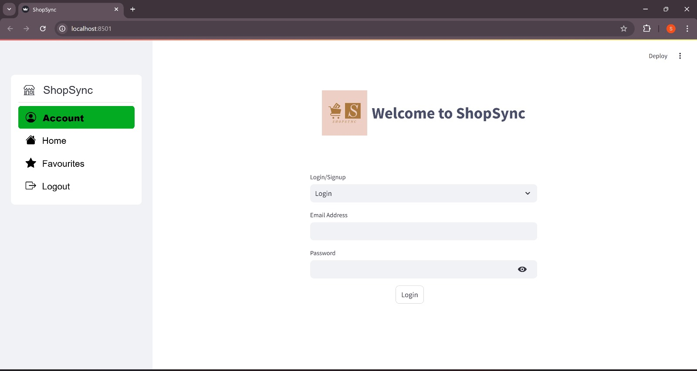
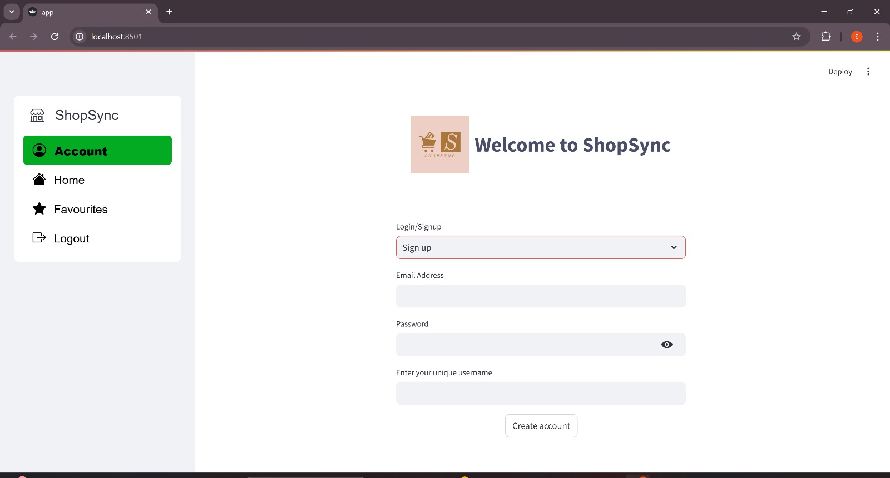
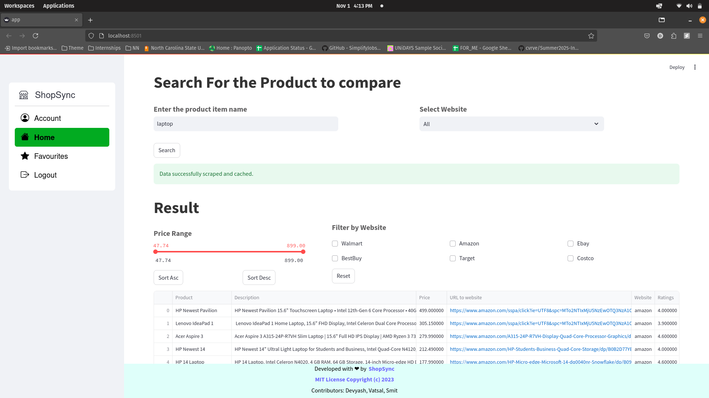
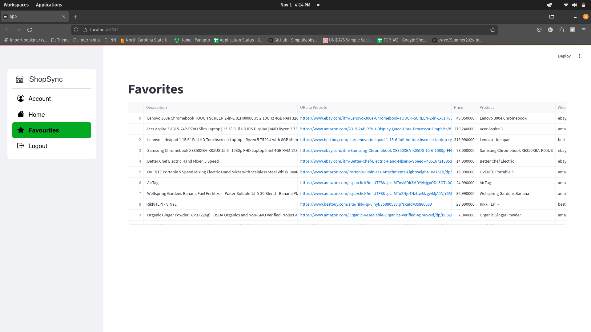

<!--Badges-->

    <a href="https://github.com/devyash2930/ShopSync-SE/issues/new/choose">Report Bug</a>
    ·
    <a href="https://github.com/devyash2930/ShopSync-SE/issues/new/choose">Request Feature</a>

---

:movie_camera: Checkout our video
---

https://github.com/user-attachments/assets/39785a3c-5a0f-46cc-8b87-db6da02b9a70

---

Are you a shopping enthusiast on the hunt for fantastic online deals? Look no further – Shopsync is your ultimate ally in the quest for the best bargains! Shopsync is a publicly accessible web API framework designed for convenient price comparison across popular e-commerce platforms. It supports well-known websites such as Amazon, Walmart, Target, BestBuy, Costco, and eBay. Currently supported websites include [Amazon](https://www.amazon.com/), [Walmart](https://www.walmart.com/), [Target](https://www.target.com/), [BestBuy](https://www.bestbuy.com/), [Costco](https://www.costco.com/) and [EBay](https://www.ebay.com/).

The key benefits of using Shopsync are:

- **Efficiency**: By utilizing Shopsync, you can drastically reduce the time spent comparing deals on various websites, often saving more than 50% of your time.
- **Simplicity**: Shopsync offers user-friendly public APIs that simplify filtering, sorting, and searching for the best deals among search results.
- **Versatility**: It generates JSON responses that are highly adaptable, allowing you to easily tailor the output to suit your specific needs.

---

  <a href="#movie_camera-checkout-our-video">Checkout our video</a>
  ::
  <a href="#computer-technology-used">Technology Used</a>
  ::
  <a href="#bulb-use-case">Use Case</a>
  ::
  <a href="#page_facing_up-why">Why</a>
  ::
  <a href="#golf-future-roadmap">Future Roadmap</a>
  ::
  <a href="#sparkles-contributors">Contributors</a>
  ::
  <a href="#Acknowledgement">Acknowledgement</a>
  ::
  <a href="#email-support">Support</a>

---

:movie_camera: Checkout our video
---

https://github.com/user-attachments/assets/3f7740ea-8326-4627-8c4f-3800d20a09fb

---

:computer: Technology Used
---

## 🔄 Work Flow

<table border="2" bordercolorlight="#b9dcff" bordercolordark="#006fdd">
  <tr style="background: #010203 ">
    <td valign="top"> 
      
 Login Page
      

      
    </td>
    <td valign="top">
     
 Signup Page
      

      
    </td>
  </tr>
  
  <tr style="background: #010203;"> 
    <td valign="top">
     
 Home
      

      
    </td>
    <td valign="top"> 
      
 Favourites
      

      
    </td>
  </tr>
</table>

---

:bulb: Use Case
---
- **User**: John, a shopping enthusiast, is looking for the best price for a smartphone across various e-commerce platforms.
- **Process**:
  1. John opens the Shopsync app and enters "smartphone" in the search bar.
  2. Shopsync fetches real-time data from multiple online retailers and displays the results.
  3. John filters the results by price and finds the best deal.
  4. He clicks the link to purchase the smartphone directly from the retailer's website.

:page_facing_up: Why
---
1. Shopping can be time-consuming, especially when comparing prices across different platforms. Shopsync aims to streamline this process, making it faster and more efficient.
2. The app's user-friendly interface allows users to easily navigate and find the best deals.
3. With Shopsync, users can save time and money, enhancing their online shopping experience.

Δ Deltas
Phase 5:
- [x] Implemented a robust user authentication system using Firestore for secure access and a personalized experience.
- [x] Added a dedicated favorites page, allowing users to store and manage preferred items with Firestore persistence.
- [x] Introduced comprehensive sorting and filtering options, including ascending/descending order and checkboxes for individual company filtering.
- [x] Implemented a reset button for users to quickly clear selections and start fresh.
- [x] Enhanced navigation with a sidebar feature for intuitive access to different sections of the application.
- [x] Significantly improved the user interface with consistent text sizes, interactive checkboxes, and filter buttons for a more engaging experience.

:golf: Future Roadmap
---
- Search History: Users can revisit previous searches for a convenient shopping experience.
- Cookies: Enhances user experience by remembering preferences and maintaining session information.
- Images for Items: Each item in search results includes images for better visual engagement.
- Remove from Favorites: Users can easily manage their favorites by removing items as needed.

:sparkles: Contributors
---
- **Devyash Shah** - [devyash2930](https://github.com/devyash2930)
- **Smit Raval** - [smitraval24 ](https://github.com/smitraval24)
- **Vatsal Patel** - [vatsal-dp](https://github.com/vatsal-dp)

---

:bulb: Acknowledgement
---
We would like to thank Professor Dr Timothy Menzies for helping us understand the process of building a good Software Engineering project. We would also like to thank the teaching assistants Liwen, Andre Lustosa, Sam Gilson, Rishabh Jain, and Amirali for their support throughout the project. We would also like to extend our gratitude to the previous groups: https://github.com/Kashika08/ShopSync and https://github.com/Neel317/ShopSync

https://streamlit.io/

https://shields.io/

:email: Support
---
For any inquiries, suggestions, or support requests, please contact us at [info@shopsync.com](mailto:info@shopsync.com).

